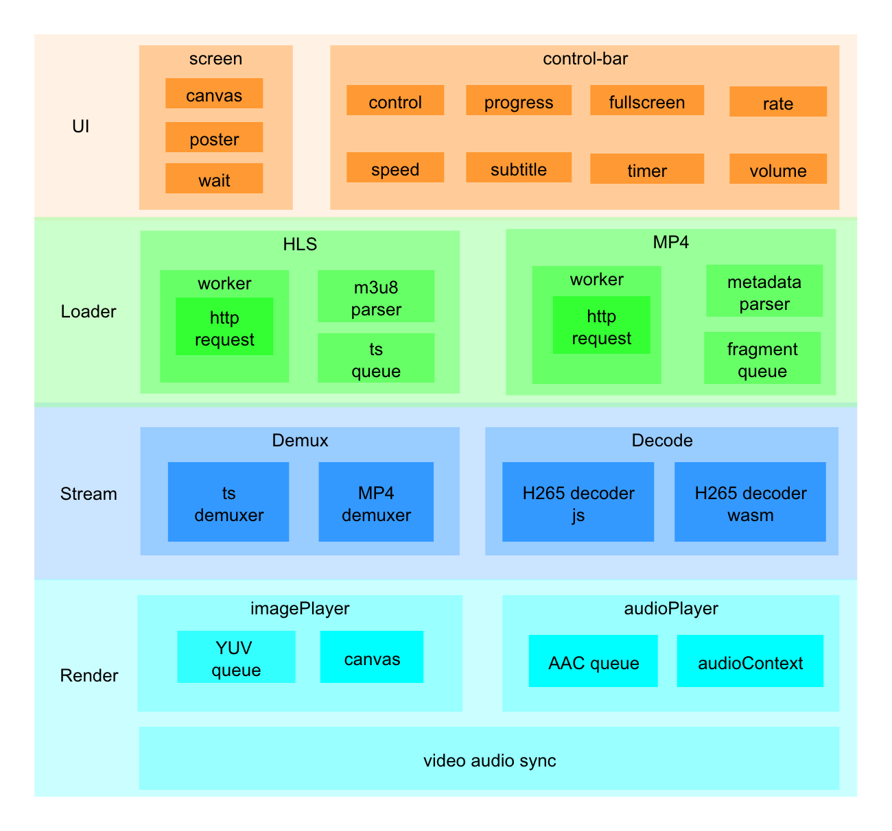

# 简介

随着视频编码技术的发展，相比H.264, H.265同等画质体积仅为一半、带宽占用省一半、画质更细腻等诸多优势。
但Web浏览器还不支持H.265的解码播放，因此基于Web Assembly(封装FFmpeg)、JS解封装、Canvas投影以及AudioContext实现Web端的H265播放。

支持主要浏览器及其版本如下：  
Chrome（>57）  
Safari (>11)  
Firefox (>52)  

本项目是一个公开的基础可用版本，并不含有具体的业务代码。业务可基于此项目进行具体业务实现。


# 安装与使用

```shell
* mkdir goldvideo
* cd goldvideo
* git clone https://github.com/goldvideo/demuxer.git
* cd demuxer
* npm install
* npm run production
* cd ..
* git clone https://github.com/goldvideo/h265player.git
* cd h265player
* npm install
* npm install ../demuxer

* 以下命令根据需要四选一
* npm run dev # 运行开发环境
* npm run test # 运行测试环境
* npm run build # 打包正式环境
* rollup -c # 打包csj与esm版本
```

## 目录结构

```
├─goldvideo
│  ├─demuxer
│  ├─h265player
```

## Nginx配置：

```
    server {
        listen       8000;
        location / {
            root   <path of goldvideo>/h265player;
            index  index.html index.htm;
            autoindex on;
        }
    }
```

## 测试页面：

```
http://localhost:8000/demo/demo.html
```

# 主要模块结构

## 整体架构图

播放器主要分为UI、Loader、数据处理、数据渲染四个部分和3个线程。一个是主线程，包括界面控制、下载控制、数据流控制、音视频控制等功能；数据加载线程，完成元数据和数据片段的请求；数据处理线程，完成数据解封装和解码。
- UI：播放器显示成，包括screen和controlbar两部分，screen包括视频图像展示、弹窗、海报图等。controlbar包括进度条、播放按钮、音量控制等组件。
- Loader：负责媒体数据的加载和解析，目前仅支持HLS协议。通过worker实现数据的请求，加载完成后，根据设置缓存大小，存储请求的ts数据，当达到缓存上限后停止加载。解码器从ts数据队列获取ts后，Hls Loader会把请求过的ts释放，继续加载下一个ts，达到最大缓存限制后停止加载
- 数据处理：主要包括数据解封装和H265解码，解封装通过demuxe.js这个类库实现，H265解码通过ffmpeg打包生成的wasm软解来实现，cpu使用率较高。
- 数据渲染：包括视屏渲染和音频渲染，视频渲染通过ImagePlayer把解码后的yuv数据直接渲染到canvas，音频通过AudioPlayer把AAC数据解码后进行音频播放，最后通过pts实现音视频的同步。同步策略是以音频为参考，判断当前视频pts与获取到的音频pts的差值来调整视频显示时间来达到音视频同步。

## 流程图
播放器主要流程如下图所示：
<div align=center>

</div>

具体流程如下：


## 解封装器
通过demuxer.js实现媒体数据的解封装，从而获取到独立的视频（H265）数据和音频（AAC）数据。详细信息请参考demuxer.js

## 解码器
通过ffmpeg实现H265数据的软解码，如果要在浏览器中调用ffmpeg，需要把ffmpeg编译成wasm进行调用，具体ffmpeg编译成wasm过程，可参考[decoder_wasm](https://github.com/goldvideo/decoder_wasm)
## ImagePlayer

通过[yuv-canvas](https://github.com/brion/yuv-canvas)实现YUV数据渲染，ImagePlayer中会有一个队列存储YUV数据，并计算当前yuv数据的时间长度，大于等于readybufferLength的值时，会触发ImagePlayerReady事件。当音视频播放器都处于ready状态时，H265播放器触发dataReady事件，开始调用play方法进行视频播放。
## AudioPlayer
　
### Web Audio API
Audio Player的实现基于Web Audio API, 包括AAC音频流的解码与PCM数据的播放。　　
- 解码：Audio Player模块接收解封装模块发过来的AAC数据流，通过AudioContext的decodeAudioData API，解码为待后续播放的PCM数据。
- 音频节点：音频节点（AudioNode）是Web Audio API中的音频数据＂处理器＂，Web Audio API通过不同“处理器”对音频数据做串行处理，最终通过扬声器（audioContext.destination）播放。
    - ScriptProcessorNode：音频源节点。Web Audio API提供多种音频源节点以提供音频数据，如AudioBufferSourceNode， MediaElementAudioSourceNode等。考虑到倍速播放的需求，我们用的是ScriptProcessorNode， 通过onaudioprocess回调函数请求音频数据。
    - GainNode：音量控制节点。   
    
### 倍速播放
Audio Context的部分音频节点提供了playbackRate属性以实现倍速播放的功能，但是音频在倍速播放的同时，音频的音调（pitch）也同步地升高/降低。   
为实现变速不变调，项目中，我们使用了一个音频数据处理库[SoundTouchJS](https://github.com/cutterbl/SoundTouchJS)，将处理过的变速不变调的音频数据提供给ScriptProcessorNode。

# 快速开始
在head标签中添加如下代码
```html
<link rel="stylesheet" href="../dist/goldplay-h265.css">
<script src="../dist/goldplay-h265-sdk.js"></script>
<style>
    .play-container{
        width: 800px;
        height: 500px;
    }
</style>
```
创建一个div，作为播放器的容器
```html
<div class="play-container"></div>
```
新建一个GoldPlay实例对象，传入相应参数，就可以实现视频的播放
```javascript
//播放器容器
let el = doc.querySelector('.play-container')
//播放器参数
let options = {
    //视频播放地址
    sourceURL: 'http://localhost:9011/gitwork/h265player/data/video2/playlist.m3u8',
    type: 'HLS'
    //wasm库地址
    libPath: 'http://localhost:9011/gitwork/h265player/dist/lib',
}
let player = new GoldPlay(el, options}
```
# 在线demo
https://omc3i.csb.app/
# 组件扩展
如何扩展UI组件请参考[文档](./docs/addComponentReadme.md)

[demo](./demo/componentadd.html)

# API
https://goldvideo.github.io/h265player/API/index.html

# 开发与维护
    * github: https://github.com/goldvideo/h265player